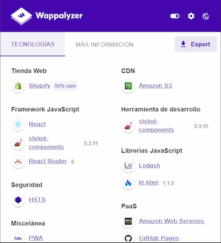

---
title: Listado de Herramientas
description: Listado de Herramientas más usados en Wordpress, tanto básicos como algunos específicos para tareas complejas que es intresante destacar
author: Adrián González
date: 19/03/2025
--- 

# Listado de Herramientas

Listado de Herramientas más usados en Wordpress, tanto básicos como algunos específicos para tareas complejas que es intresante destacar

!!! note

    Lorem ipsum dolor sit amet, consectetur adipiscing elit. Nulla et euismod
    nulla. Curabitur feugiat, tortor non consequat finibus, justo purus auctor
    massa, nec semper lorem quam in massa.

  

    <h3>1. Wappalyzer</h3>
    
Extensión que se puede usar para veer de que están hechas las páginas. Por ejemplo, si están hechas con Wordpress, Shopify, que librerías usa o que frameworks, etc. 

    <a href="https://www.wappalyzer.com/"> Website ↗️</a> 
    <a href="https://chromewebstore.google.com/detail/wappalyzer-technology-pro/gppongmhjkpfnbhagpmjfkannfbllamg?hl=es"> Extensión ↗️</a>
  

  

    
  

  

    <h3>2. Squoosh.app</h3>
    
Página que sirve para convertir las imágenes a otros formatos y redimensionarlas. Muy completa y con múltiples opciones para ajustarse a lo que quieras

    <a href="https://squoosh.app/"> Website ↗️</a> 

  

  

    
  

