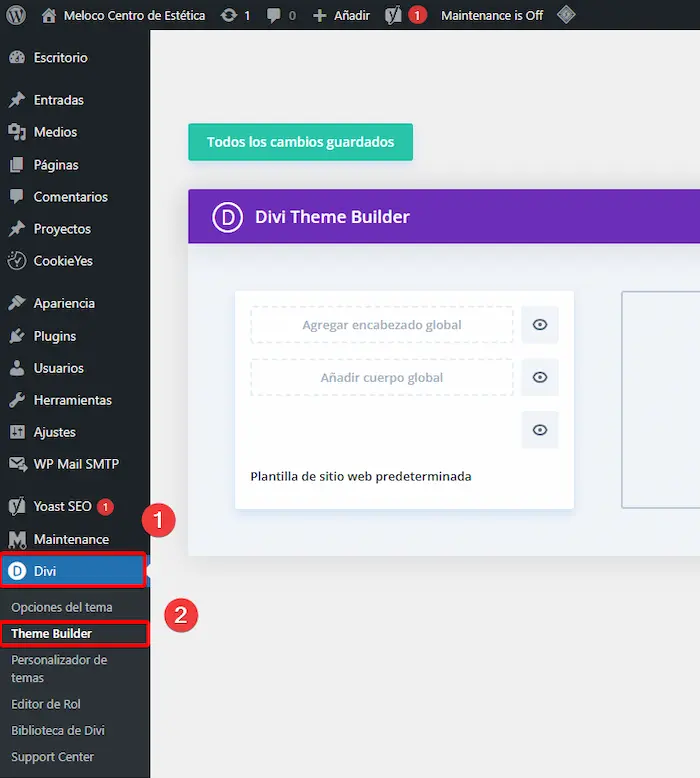
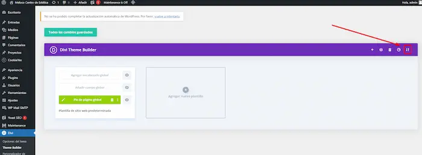
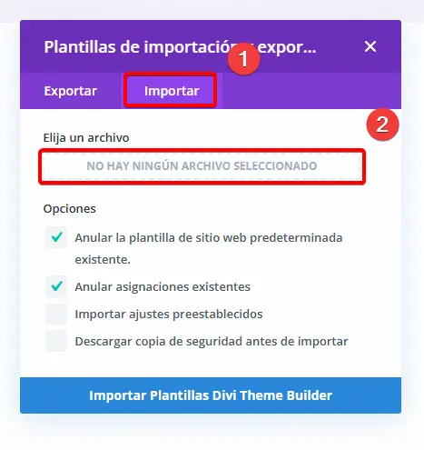
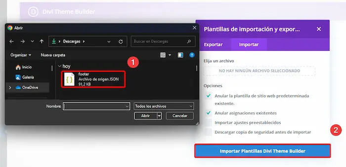
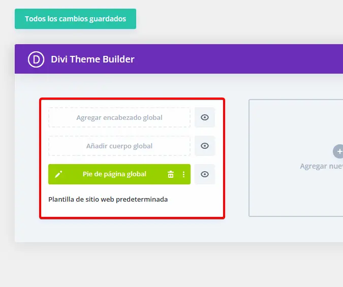
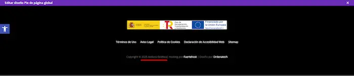
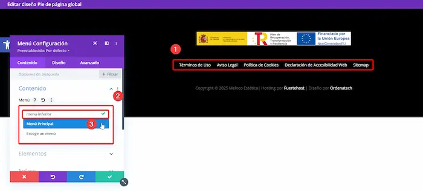
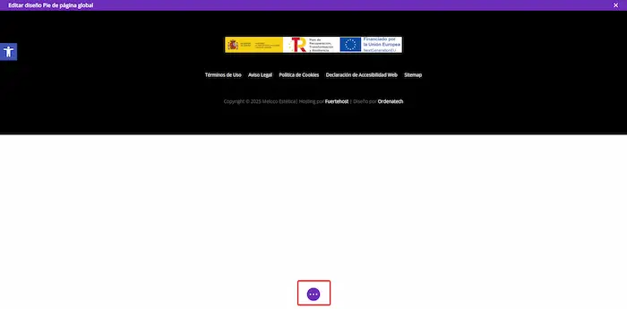
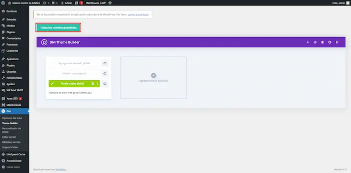

# Añadir Footer estándar para Kit Digital con Divi

!!! warning Cuidado
   
      REQUISITOS 
      Para poder llevar a cabo este tutorial, debe estar añadido y activado el plugin <a href="../../../files/políticas/politicas.zip">Políticas</a>

## Paso 1 - Descargar archivo.

Para importar el footer, necesitaremos el archivo de Divi que se encuentra en un JSON, el archivo es este: [footer.json](https://github.com/user-attachments/files/18690442/footer.json)

## Paso 2 - Importar en Divi.

Accedemos a Divi ➡️ Theme builder

   

Una vez dentro, pinchamos en el icono de importar ↕️

   

Se nos abrirá un menú de Importación de plantillas. Pinchamos en importar y en el recuadro que indica **"No hay ningún archivo seleccionado"**

   

Aquí tendremos que añadir el archivo JSON descargado anteriormente. Dento de este archivo se encuentra la cofiguración prestablecida para el footer. Seleccionaremos el archivo footer.json y luego en **"Importar Plantillas Divi Theme Builder"**

   

Ahora aparecerá el bloque del Footer ya importado el cual se añadirá automaticamente a todas las plantillas que creemos a partir de aquí.
      
   

## Paso 3 - Editar Footer.

Clicamos en el icono del lápiz y entraremos a editar el Footer.✏️

   

Una vez dentro, actualizamos la información, Año y Nombre de Empresa

   

!!! bug CUIDADO BUG IMPORTANTE

      El menú inferior se queda bugueado y no muestra correctamente el menú inferior.
      Para arreglarlo en la parte del menú, lo editamos, seleccionaremos **Menú Principal** y luego **menu-inferior**. Así debería arreglarlo.
      

## Paso 5 - Guardar los cambios.

Para terminar, simplemente nos quedará guardar, pinchamos los 3 puntos del eje inferior y el botón de guardar

   

   

Ya una vez guardado saldremos en la X de la esquina superior derecha

   

Importante que para finalizar siempre guardaremos en Theme Builder

   

