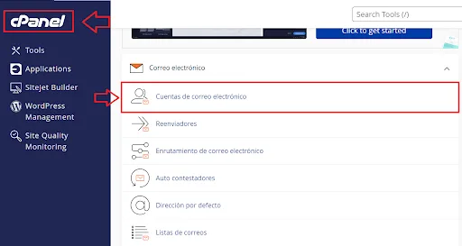
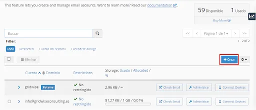
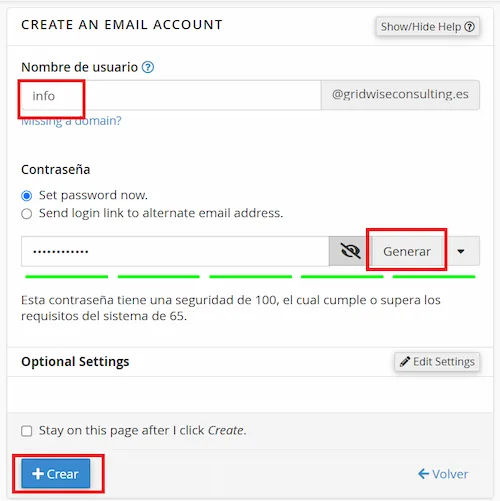
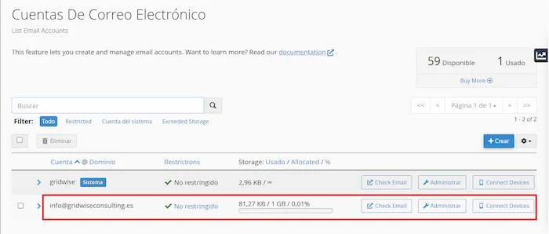
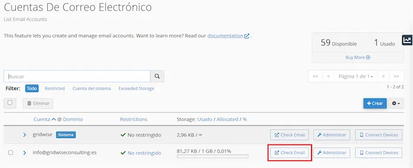
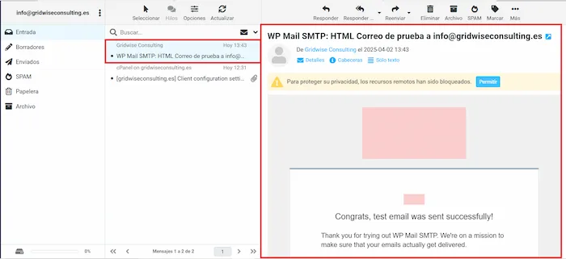
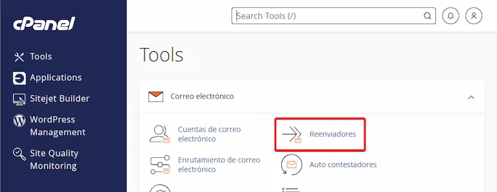
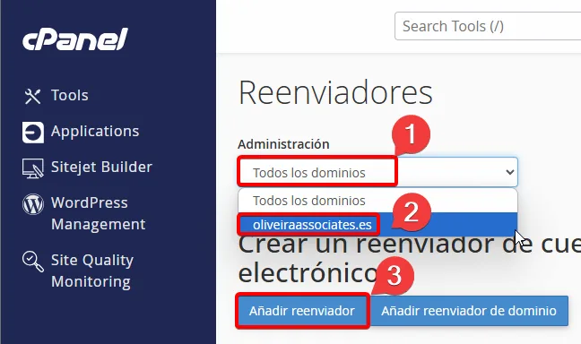
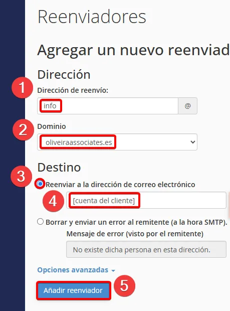

--- 
title: Crear cuentas de correo para el dominio del cliente
description: Crear cuentas de correo para el dominio del cliente y que se use como correo corporativo y redireccionar a la cuenta de correo del cliente.
author: Guillermo
date: 04/04/2025
---

# Crear cuentas de correo para el dominio

### Crear correo
Para crear una cuenta tendremos que acceder al apartado de correos del CPanel. En el apartado "Tools" clicaremos y se nos abrirán las principales herramientas del CPanel.

Buscaremos el apartado "**Cuentas de correo electrónico**" y clicaremos en él.

 
En el panel que nos aparecerá a continuación, clicaremos en el botón "**Crear**" para crear una nueva cuenta de correo electrónico.

 
A continuación, se nos abrirá un formulario donde tendremos que rellenar los siguientes campos:

- Nombre de usuario: info (revisar que el @ sea el del dominio del cliente)
- Contraseña: la generaremos automáticamente.

Una vez rellenados los campos, clicaremos en el botón "**Crear**" y crearemos la cuenta de correo electrónico.

 
Una vez cargue la página, deberíamos ver en el panel de control anterior la nueva cuenta de correo creada.

### Visualizar los correos
Para ver los mails que hemos recibido vamos a ir al panel de *Cuentas de correo electrónico* y en la cuenta que queramos ver el mail, clicaremos en el botón "**Check Mail**".

 
Se nos abrirá una nueva pestaña donde podremos ver los correos que hemos recibido en la cuenta de correo electrónico.

### Redireccionar el correo a la cuenta del cliente

!!! warning Cuidado
    Tener en cuenta que al añadir redireccionadores, le llegarán todos los correos a la cuenta de trabajo del cliente. Así que no añadir redireccionadores hasta haber indexado la página en **Cylex** y **Google My Business** para que no le lleguen los coreros de verificación a la cuenta del cliente.

Para redireccionar el correo a la cuenta del cliente, clicaremos en el botón "**Reenviadores**" que se encuentra en el panel de "**Tools**".

 

Una vez dentro nos aparecerán todas las opciones del reenviador. Seleccionaremos el dominio del cliente del que queremos que se reenvien lso correos y clicaremos en "**Añadir reenviador**".

 

Aquí rellenaremos todos los campos del formulario:

1. La dirección desde donde saldrán los correos (normalmente "info").
2. Verificar que el dominio es el correcto.
3. La dirección de correo electrónico a la que queremos que se reenvíen los correos (la del cliente).
4. Clicaremos en el botón "**Añadir reenviador**" para finalizar el proceso.

 
Una vez completados todos estos pasos, ya tendremos la cuenta de correo creada y redireccionada a la cuenta del cliente.