# Pasos para crear una web de kit digital desde cero.

## Inicio del proyecto

En la etapa inicial del proyecto, Cristian será el responsable de establecer comunicación directa con el cliente para comprender sus necesidades y definir los términos del acuerdo preliminar. Este acuerdo puede estar relacionado con el programa Kit Digital o con la creación de una página web personalizada.

Tras alcanzar un entendimiento mutuo y acordar los términos, se enviará al cliente una propuesta detallada del presupuesto. Una vez que este documento sea revisado, aprobado y firmado por el cliente, se procederá a dar inicio al proceso de planificación y desarrollo de la página web.

## Fase 1: Inicio del proyecto

### Concretar reunión
En esta fase, el equipo de desarrollo se pondrá en contacto con el cliente, ya sea por correo electrónico o mediante una llamada telefónica, con el objetivo de coordinar una reunión en línea a través de Google Meet.

Paralelamente, se procederá a la creación de la carpeta del cliente en el Drive compartido de la empresa, tarea que habitualmente realiza Marco. Dentro de dicha carpeta, se deberá importar la plantilla correspondiente, ya sea para un Sitio Web o para un Comercio Electrónico, según el tipo de bono asignado dentro del programa Kit Digital.

<html>

</html>
!!! tip Necesario
    Llegados a este punto, la tarea de crear la página web debería estar creada en el Github de Marco con su plantilla correspondiente donde organizamos todo el contenido.
    

### Primera reunión

Llegado el día de la reunión, usaremos la plantilla de "**1º Reunión**" para tener una guía de todos los datos que tenemos que recoger del cliente para poder crear la web sin problemas. 

 
Durante esta reunión, será fundamental que el cliente elija el dominio que desea utilizar para su página web, ya que esta decisión será definitiva y no podrá modificarse posteriormente.

Para garantizar que el dominio seleccionado esté disponible, se utilizará la herramienta de verificación en línea proporcionada por [dominios.es](https://www.dominios.es/es), donde se puede comprobar si el nombre elegido está libre o ya está en uso.

!!! tip Importante
    Debemos enfocarnos sobre todo en que el cliente nos cuente a que se dedica y sus servicios, para saber como enfocar bien el diseño de la web.

### Post 1º reunión

Una vez terminada la reunión, la persona asignada a crear la web buscará plantillas que concuerden con el sector del cliente, usualmente 4-5 que puedan resultar interesantes. 

Las páginas que solemos usar para buscarlas son:

- Para el Tema de Divi:
    🔴 [**Elegant Themes - Divi Layouts**](https://www.elegantthemes.com/layouts/)
    🔴 [**Divi Express**](https://divi.express/)

También compartiremos la carpeta "**Datos**" con el coreo personal del clente donde nos compartirá toda la información necesaria para crear la página web.

### Conseguir  el dominio
Este paso será gestionado por Cristian, quien tiene acceso a la cuenta de FuerteHost, la plataforma donde se administran los dominios. Cristian se encargará de reservar el dominio seleccionado por el cliente durante la reunión, asegurando que quede registrado correctamente.

### Instalar Wordpress desde Fuertehost
Normalmente, Cristian será el encargado de instalar WordPress directamente desde el panel de control de FuerteHost, utilizando las herramientas disponibles para simplificar el proceso. Sin embargo, si no puede realizar esta tarea, la instalación también se puede llevar a cabo desde el cPanel del sitio web. Para ello podemos mirar el tutorial de <a href="/01_Guias/01_Web_Principal/install_wordpress/"> **Instalar Wordpress**.</a>

### Instalar y activar Divi
Al instalar WordPress, habitualmente se utiliza un paquete preconfigurado desarrollado por Ordenatech para el programa Kit Digital. Este paquete incluye el tema Divi y los plugins esenciales necesarios para comenzar a trabajar en el proyecto de manera eficiente.

Una vez finalizada la instalación, se notificará a Marco para que envíe un ticket al soporte técnico de Sered solicitando la activación de Divi. Este proceso de activación puede tardar desde unos minutos hasta varias horas, dependiendo de los tiempos de respuesta del proveedor.

## Fase 2: Desarrollo de la web
### Crear las cuentas de correo necesarias desde el CPanel

Para crear cuentas de correo, ver el correo creado en dominio o añadir reenviadores, consulta el siguiente documento: <a href="/01_Guias/01_Web_Principal/cuentas_de_correo"> **Creación de correos.**</a>
Redirección al tutorial

### Revisar plugins

Antes de iniciar el desarrollo de la web, es crucial realizar una revisión de los plugins instalados en el paquete de Kit Digital. Este paso consiste en comprobar que todos los plugins estén actualizados a su última versión y que no presenten conflictos entre ellos.

Para llevar a cabo esta verificación, se debe acceder al "**Escritorio**" de WordPress, dirigirse a la pestaña de "**Plugins**" y revisar el estado de cada uno. Si algún plugin requiere actualización, se procederá a actualizarlo desde esta misma sección, asegurando así un entorno estable y funcional para el desarrollo del proyecto.

 
Si algún plugin necesita ser actualizado, WordPress lo indicará automáticamente mediante una notificación visual en forma de un círculo rojo. Este círculo, ubicado junto al apartado de Plugins en el menú del Escritorio, mostrará el número de actualizaciones pendientes.

### Crear páginas principales

Una vez activado el Divi, procederemos a crear las páginas principales que nos haya indicado el cliente en la reunión (normalmente [Inicio, Sobre Nosotros, Servicios/Productos, Contacto]). Para ello, iremos a la pestaña de "**Páginas**" y "**Añadir nueva Página**".

 
Con esto crearemos la estructura principal de la web, donde luego iremos añadiendo el contenido que nos haya pasado el cliente.

### Menú

Una vez creadas las páginas principales, podremos crear el menú principal que colocaremos en el Header.

Iremos a "**Apariencia**" ➡️ "**Menús**" ➡️ "**Crear un nuevo menú**".

 
Ahora rellenaremos el campo de "*Nombre*" con ➡️ Menú Principal

Y seleccionaremos en "*Dónde se verá*" ➡️ Menú Principal

Para crearlo, simplemente pulsamos en "**Crear menú**" y se nos creará el menú.

  

En este menú añadiremos las páginas que hemos creado anteriormente. Para ello, simplemente seleccionamos las páginas que queremos añadir (en el menú de la izquierda) y pulsamos en "**Añadir al menú**".

 
Por último, le daremos a "**Guardar menú**" y ya tendremos el menú creado con todas las páginas creadas.

### Enlaces permanentes

Si accedemos al dominio del cliente, notaremos que aunque hemos creado las páginas principales y el menú, estos no se ven. Porque Wordpress no está detectado la página de **Inicio** como la página principal. Para ello deberemos cambiar los enlaces permanentes.

Accedemos a "**Ajustes**" ➡️ "**Enlaces permanentes**" y seleccionamos la opción de "**Nombre de la entrada**".

 
Una vez hecho esto, le daremos a "**Guardar cambios**" y ya tendremos el nombre de los enlaces cambiados. Ahora la página de **Contacto** por ejemplo se mostrará como [domino del cliente]/contacto/ y no con un nombre raro.
  
Pero esto no es todo, deberemos acceder a **Ajustes** ➡️ "**Lectura**" y seleccionar la opción de "**Una página estática**". Colocar como página estática la página que queramos que sea la principal, usualmente **Inicio**.

### Footer

Para añadir el footer, nos podemos guiar por la siguiente documentación:  <a href="/01_Guias/01_Web_Principal/Footer/footer/"> Añadir Footer</a>

### Header
El encabezado de Divi es un poco especialito, ya que no se puede editar como el resto de las páginas. 

Para ello, deberemos ir a "**Apariencia**" ➡️ "**Personalizar**" ➡️ "**Encabezado y navegación**".

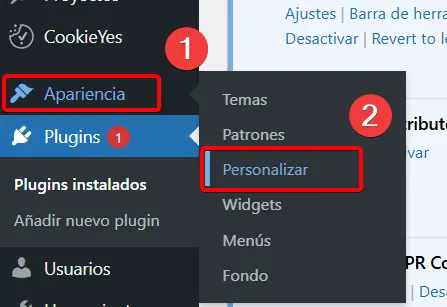

### Editar con Divi
Para editar con Divi, simplemente accedemos a la página que queremos editar y le damos a "**Activar el constructor Divi**".

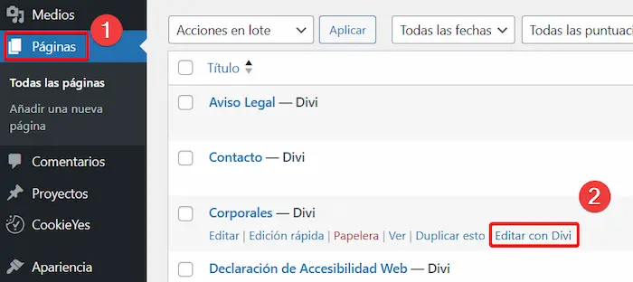

Se nos abrirá la página con el overlay de edición de Divi, aquí ya podremos añadir bloes y demás que queramos para editar la página.

Para saber como editar con Divi puedes hacer el curso que tiene Ordenatech en Udemy

Curso Udemy de Divi: 

O ver algún tutorial en Youtube, como este:

<iframe style="display: block; margin: auto;" width="560" height="315" src="https://www.youtube.com/embed/B-8KGxBxXRY?si=UR75bd6Nf1Sh2VOo" title="YouTube video player" frameborder="0" allow="accelerometer; autoplay; clipboard-write; encrypted-media; gyroscope; picture-in-picture; web-share" referrerpolicy="strict-origin-when-cross-origin" allowfullscreen></iframe>

### Importar template de Divi

Normalmente las páginas no las empezaremos a desarrollar desde cero. Esperaremos a que el cliente elija la plantilla que quiera y a partir de ahí, la editaremos a su gusto.

#### 🔴 Para Divi Express 

Para Divi Express, iremos a "**Divi**" ➡️ "**Biblioteca Divi**" ➡️ "**Importar y exportar**".

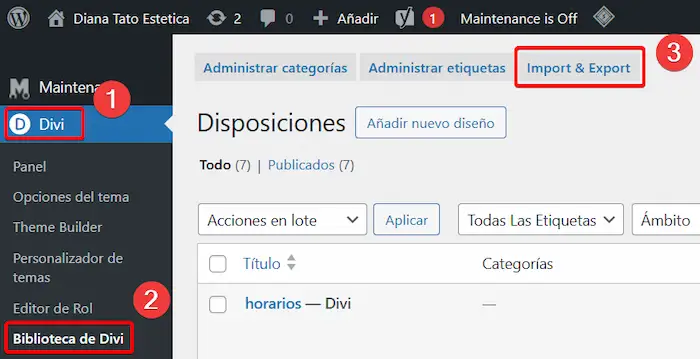

Aquí tendremos que elegir el archivo JSON que contenga la plantilla elegida por el cliente.

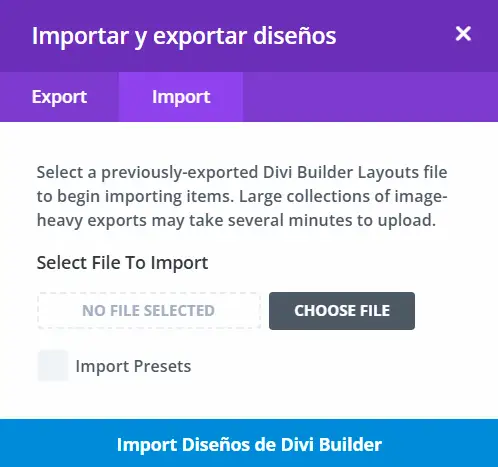

Una vez que la plantilla ha sido importada correctamente, el siguiente paso será aplicarla a las páginas deseadas del sitio web. Para hacerlo, se debe seguir este procedimiento:

  - Accede al Escritorio de WordPress y selecciona la página en la que deseas añadir la plantilla.

  - Haz clic en la opción Editar con Divi para abrir el editor visual.

  - Dentro del editor, selecciona la opción Elegir diseño.

  - Desde el catálogo de diseños disponibles, selecciona la plantilla previamente importada y aplícala a la página.

Este proceso permitirá personalizar las páginas del sitio de manera rápida y eficiente utilizando los recursos del tema Divi.

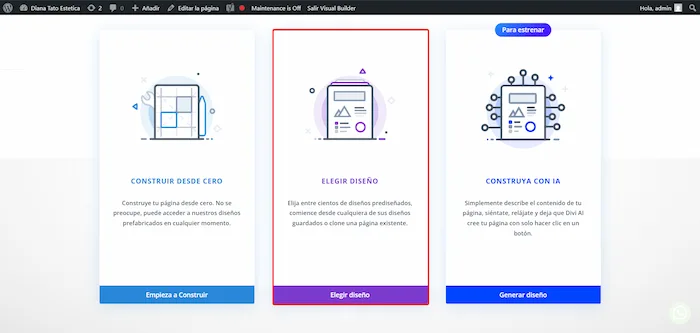

#### 🔴 Para Divi Layouts (Elegant Themes) 

Vamos directamente al editor de Divi en la página que queramos añadir la plantilla y en el menú que nos sale le daremos a "**Elegir diseño**".

Dentro de ahí buscaremos el nombre de la plantilla que eligió el cliente y la seleccionamos.

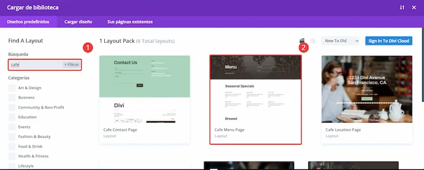

Luego se nos abrirá la ventana del template y le daremos a "**Use this Layout**".

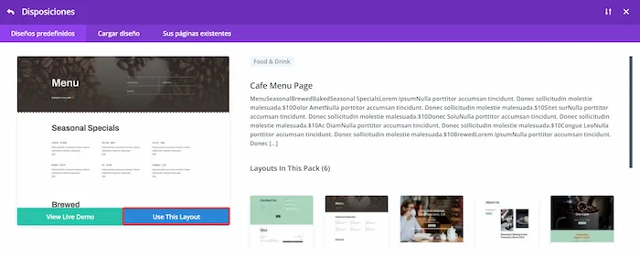

Con eso se importará automáticamente la plantilla y la podremos editar a nuestro gusto.

### ReCaptcha v3
Cada vez que añadamos un formulario a la web, deberemos añadir el reCaptcha v3 para evitar spam. Para ello, seguiremos los siguientes pasos:

   - Ir a la página de reCaptcha de Google: [Google reCaptcha](https://www.google.com/recaptcha/admin/create)
      - Iniciar sesión con la cuenta de Google de becario.

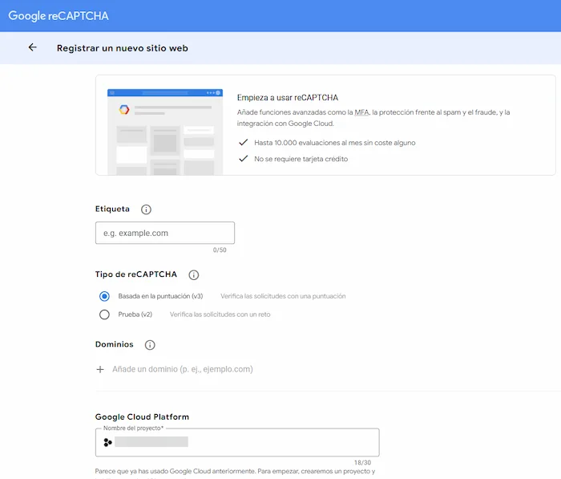

Rellenaremos los campos según la web que estemos haciendo. y una vez terminado, nos llevará a la página donde nos mostrará la clave pública y privada del reCaptcha para ese dominio.

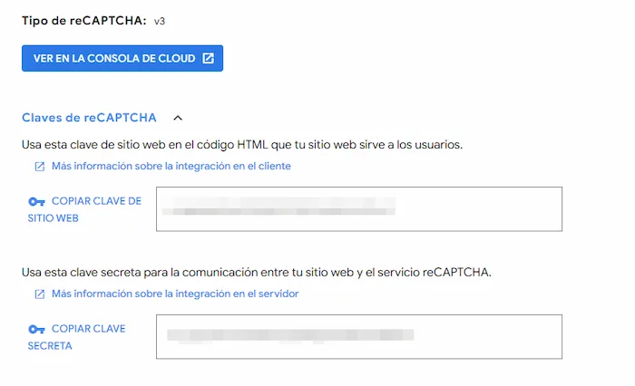

Dejaremos esa página abierta ya que necesitaremos esas claves para añarilas a la web.

Vamos a la página donde está el formulario y entramos en las opciones del mismo. Accederemos al apartado de "**Protección contra el Spam**". Como proveedor de servicio seleccionamos ReCaptcha y añadimos las claves que nos ha dado Google. Ponemos nombre para el perfil "Ordenatech"

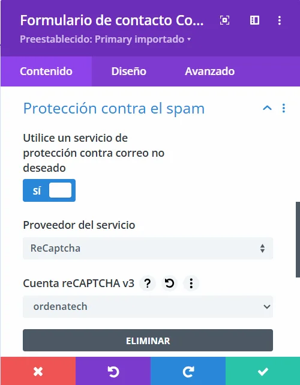

!!! warning
    Hay que compartir el reCAPTCHA a cristian@ordenatech.es y a marco@ordenatech.es para que ellos tengan también acceos al reCAPTCHA.

### SEO

El SEO (Search Engine Optimization) es el conjunto de técnicas destinadas a optimizar páginas web para mejorar su posicionamiento en los motores de búsqueda, como Google, aumentando su visibilidad y tráfico orgánico. Se aplica mediante estrategias como el uso de palabras clave, metaetiquetas, contenido relevante, enlaces internos y externos, y una estructura técnica adecuada.

Para configurarlo de forma sencilla necesitaremos el plugin de Yoast SEO, que debería estar instalado con el paquete de plugins inicial.

Vamos a "**Yoast SEO**" ➡️ "**General**" ➡️ "**Configuración Inicial**".

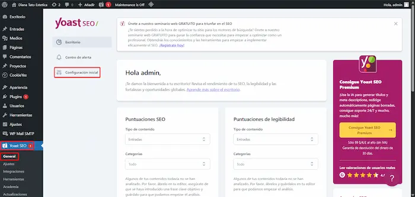

Seguiremos la configuración inicial, proporcionandole al plugin todos los datos que sepamos sobre el cliente.

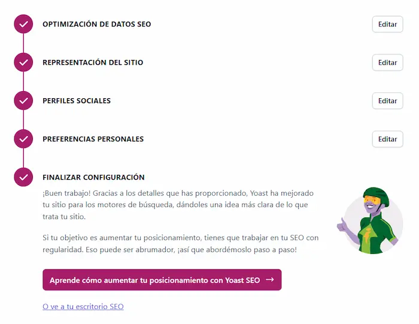

Una vez terminemos este apartado, accederemos a editar la página (no con Divi) de "**Inicio**" y en la parte inferior de la página, nos aparecerá el apartado de Yoast SEO. Aquí podremos añadir el "título SEO", "palabra clave" y la "descripción SEO" de la página.

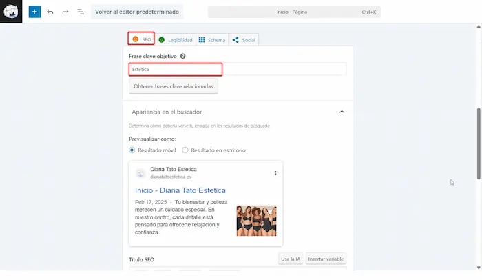

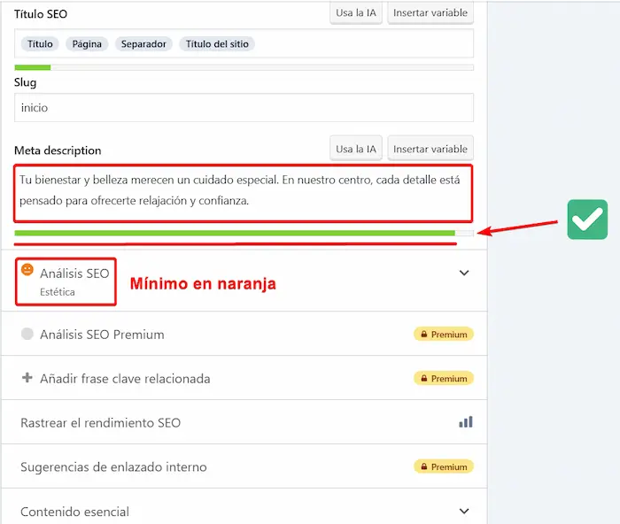

La cara del análisis SEO nos indicará si el SEO está bien o no. Si está en verde, significa que está bien, si está en rojo, significa que hay que cambiar algo. Normalmente lo podemos dejar en narajna, pero si tenemos tiempo es mejor que lo mejoremos hasta que esté en verde.

La "Meta description" debe tener la barra en verde. Nos la inventaremos o la sacaremos de la IA.

Esto mismo lo haremos en la página de "**Contacto**".

### Idiomas

Para la traducción de la web, utilizaremos el plugin GTranslate. Este plugin permite traducir automáticamente el contenido de la página a varios idiomas, facilitando la accesibilidad y comprensión para usuarios de diferentes regiones.

En caso de que el cliente quiera añadir los idiomas de forma manual, usaremos otro plugin distinto.

Para añadir los idiomas seugiremos el siguiente tutorial: <a href="/01_Guias/01_Web_Principal/add_languages/">**Tutorial Idiomas**</a>

## Fase 3: Indexación y justificación

### Google My Business

Para que la web aparezca en google con la tarjeta de empresa, es necesario añadirla a Google My Business. 

Nos encontraremos con casos en los que el cliente ua ha registrado su negocio en Google My Business, por lo que no será necesario añadirlo. En caso de que no lo haya hecho, le comunicaremos que tiene que cambiar el link de su página web linkeada en Google My Business para que aparezca la nueva página que le creamos nosotros.

En caso de que no la tenga registrada, es necesario que la registremos nosotros.

Accederemos al siguiente link: [My Business](https://business.google.com/)

Ahí nos registramos con la cuenta de becario si no está registrada y añadiremos una nueva empresa. Seguimos los pasos añadiendo la información que nos solicitan y cuando terminemos la empresa quedará registrada en Google My Business.

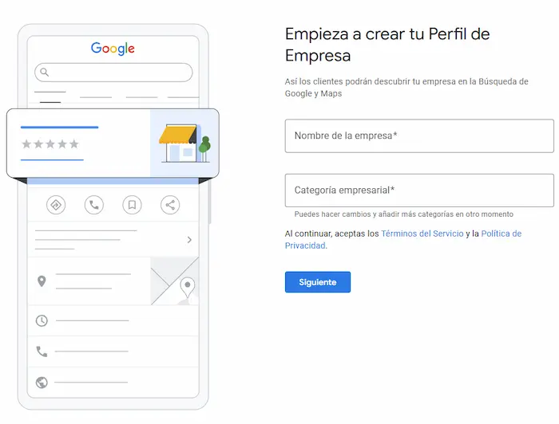

!!! warning
    Hay que compartir el acceso a cristian@ordenatech.es y a marco@ordenatech.es para que ellos tengan también administración.

### Google Search Console
Google Search Console es una herramienta gratuita de Google que permite a los propietarios de sitios web supervisar y optimizar su presencia en los resultados de búsqueda de Google. Proporciona información valiosa sobre el rendimiento del sitio, la indexación, las palabras clave y otros aspectos técnicos que pueden afectar la visibilidad en línea.

Básicamente, que si no registramos la empresa aquí, no aparecerá en Google. Por lo que es necesario que lo hagamos para que el cliente pueda ver su página web desde el buscador (sino, se van a quejar).

Accederemos al siguiente link: [Search Console](https://search.google.com/)

Y nos registraremos si la cuenta de usuario no está registrada. Una vez dentro, le daremos a "**Añadir propiedad**" y añadiremos el dominio del cliente.

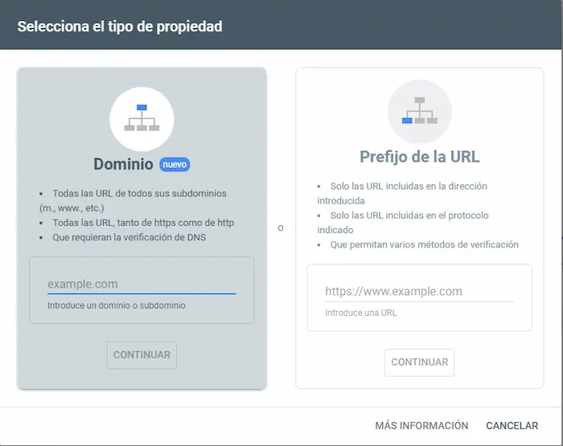

Una vez nos haya verificado, nos pedirá que añadamos una verificación de la página. Lo haremos con "**Etiqueta HTML**", copiamos el mensaje que nos sale debajo. No cerramos la página.

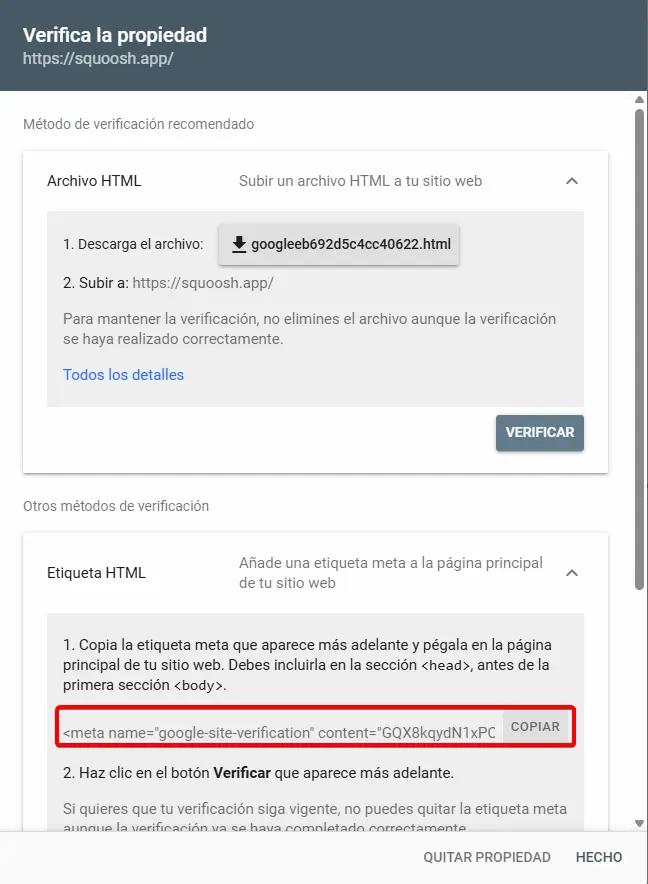

Una vez copiado el código que nos proporcionan, nos dirigimos al panel de administración de WordPress y accedemos a la sección de "**Ajustes**" ➡️ "**Yoast SEO**" ➡️ "**General**" ➡️ "**Conexiones del sitio**". Y pegamos en el apartado de Google el código que nos han proporcionado. Luego le daremos a "**Guardar cambios**".

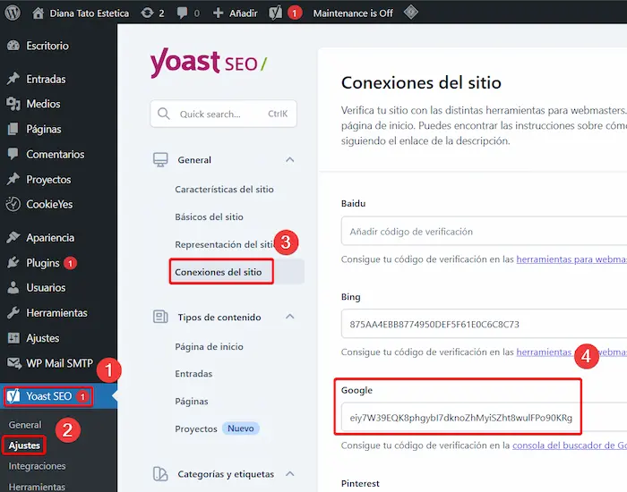

Una vez guardado, volveremos a la pestaña de Google Search Console y pulsamos en el apartado de "Etiqueta HTML" en "**Verificar**". Esperamos a que termine de verificar y si todo ha ido bien, nos saldrá un mensaje de que la verificación ha sido correcta.

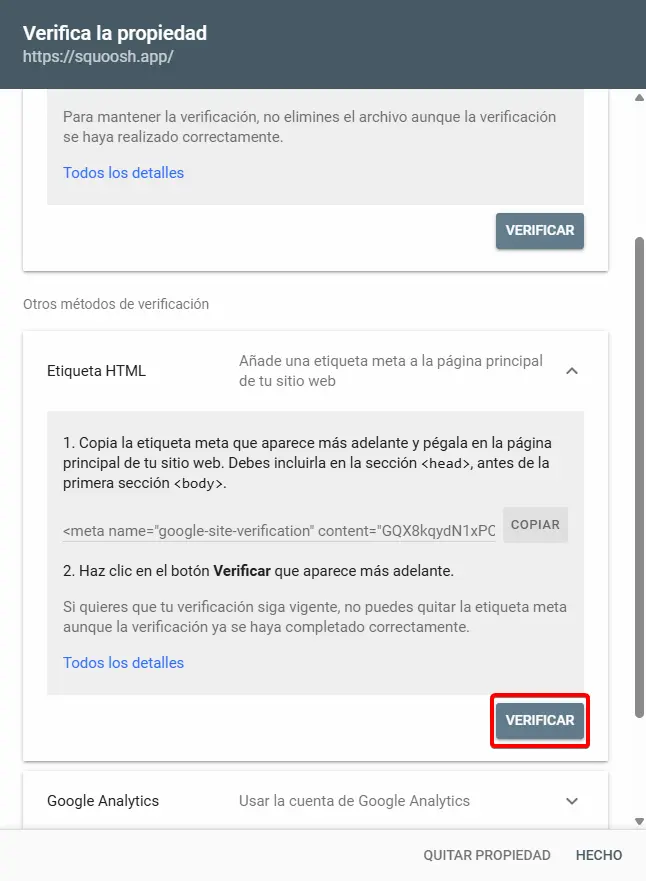

!!! warning
    Hay que compartir el acceso a cristian@ordenatech.es y a marco@ordenatech.es para que ellos tengan también administración.

### Bing

Para añadi rla página al buscador de Bing será similar a Google Search Console, pero en este caso podemos hacerlo de forma más sencilla, ya que Bing nos permite importar la verificación desde Search Console directamente.

Accedemos a [Bing webmaster Tools](https://www.bing.com/webmasters/about)

Entramos con la cuenta que usamos en Search Console y al darle a añadir propiedad, nos dará la opción de importar la verificación desde Google Search Console. 

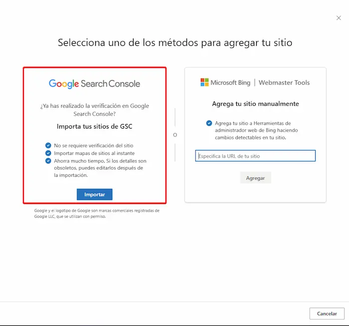

Le damos todos los permisos y seleccionamos solo la página que queremos importar.

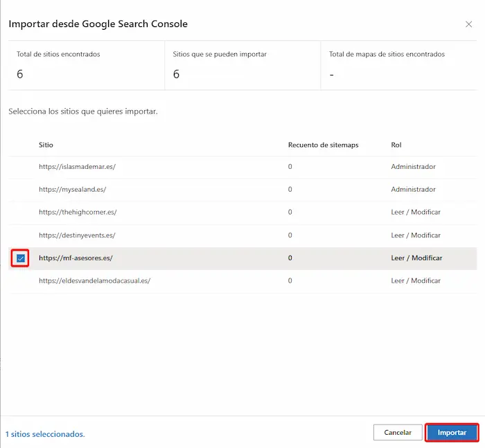

Una vez hecho esto, ya tendremos la página añadida a Bing y nos saldrá un mensaje de verificación

!!! warning
    Hay que compartir el acceso a cristian@ordenatech.es y a marco@ordenatech.es para que ellos tengan también administración.

### Cylex | Firmania | Encuentre Abierto 

Para la justificación del Kit Digital, es necesario añadir la página web a los portales de Cylex, Firmania y Encuentre Abierto. Estos portales son directorios de empresas que permiten a los negocios locales aumentar su visibilidad en línea y atraer más clientes potenciales.

Tienen un sistema en el cual, cuando registras la empresa en Cylex, se añade automáticamente a Firmania y Encuentre Abierto.

Para ello accedemos a la Web de [**Cylex**](https://www.cylex.es/), nos registramos con la cuenta de becario si no está registrada y le damos a "**Registrar empresa**"

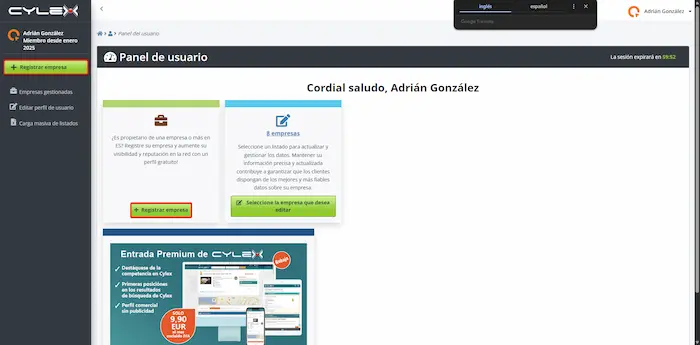

!!! tip
    Es posible que no nos deje registrar la web, si nos sale lo siguiente no podremos hacerlo, contactar con Marco.
    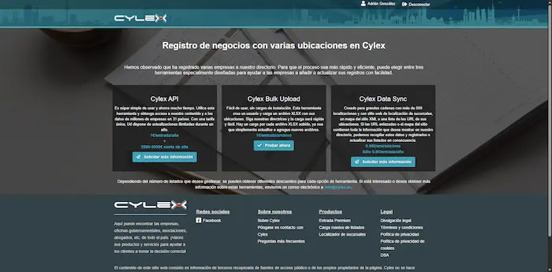

Una vez terminemos el registros de la empresa, inmediatamente lo tendremos en cylex y firmania. encuentre abierto suele tardar entre unos minutos y unas cuantas horas (a veces hasta 24). Tenemos la teoría de que no aparece en encuentre abierto hasta que el horario del local esté abierto.

Para ver los perfiles de cada uno de ellos, dentro del panel de control de la empresa, accederemos al botón "**Ver perfil público**" y aparecerán los links en el selector.

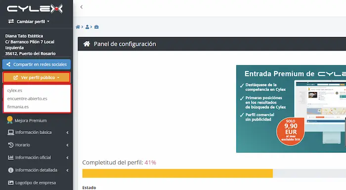

Estos 3 links de cada página los necesitaremos para la justificación del Kit Digital.

#### Cambiar imagen de perfil en Cylex
En el panel de control de la empresa nos aparecerá un apartado para subir el logotipo, lo cargamos y lo guardamos. Se actualizará en las 3 páginas.

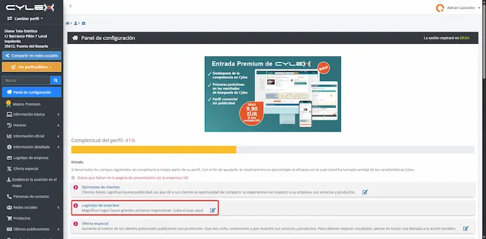

### Justificación

Al final del desarrollo de una Web de Kit Digital, deberemos hacer la justificación del bono.

Para ello vamos a seguir el siguiente tutorial: <a href="">Guía Justificación</a>

### Final

Una vez llegado a este punto, solo quedará avisar al cliente por correo para que vea la página y agendar una segunda reunión para que comente que le parece, los cambios que quiera y demás. Solo queda esperar a que mande los cambios y seguir con el mantenimiento de 1 año que tienen gracias al Kit Digital.
