# Pasos para crear una web de kit digital desde cero.

## Inicio del proyecto

Al inicio de todo el proyecto, será Cristian quien se encargue de hablar con el cliente y plantear el acuerdo inicial, ya sea para el Kit Digital o para simplemente hacer una web.

Unaa vez se haya llegado a un acuerdo, se le pasará el presupuesto al cliente y se le pedirá que lo firme. Una vez firmado, se procederá al planteamiento de la Web.

## Fase 1: Inicio del proyecto

### Concretar reunión
Aquí es donde desde el equipo de desarrollo nos ponemos en contacto con el cliente a través de correo electrónico o de llamada telefónica para concretar una reunión online por Meet con el mismo.

En este punto ya se puede crear la carpeta de cliente en el Drive compartido de la empresa (normalmente lo hace Marco). Dentor de la carpeta se deberá importar la plantilla de carpeta de Sitio Web o Comercio electrónico, dependiendo del bono que tenga del kit digital.

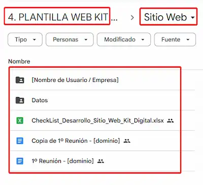

!!! tip Necesario
    Llegados a este punto, la tarea de crear la página web debería estar creada en el Github de Marco con su plantilla correspondiente donde organizamos todo el contenido.
    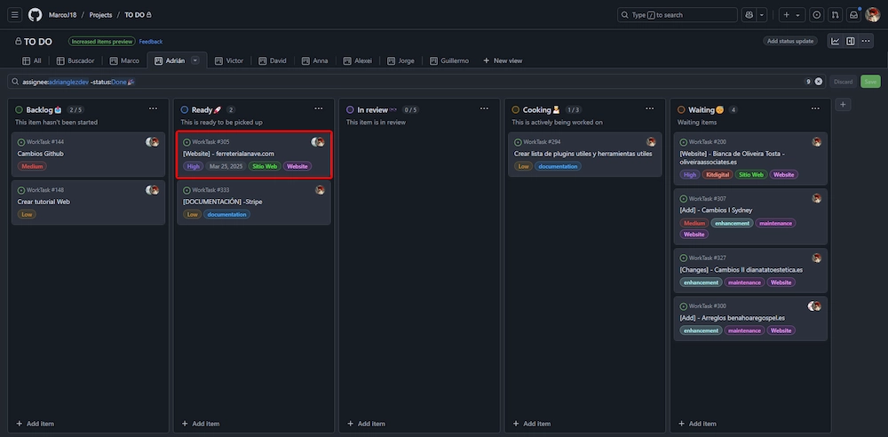

### Primera reunión

Llegado el día de la reunión, usaremos la plantilla de "**1º Reunión**" para tener una guía de todos los datos que tenemos que recoger del clente para poder crear la web sin problemas. 

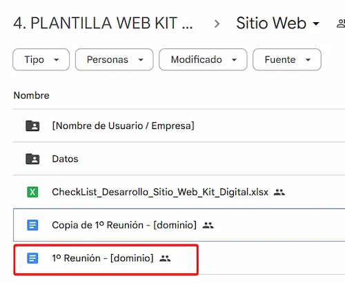
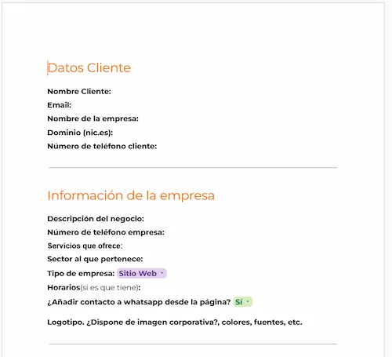
<br>
En esta reunión será importante que el cliente decida que dominio quiere usar para su página web, ya que será un punto de no retorno y no se pdorá cambiar en el futuro. 

Para verificar que el dominio que ha elegido no está en uso, podemos usar la página de [dominio.es](https://www.dominios.es/es) y comprobar si está libre. 

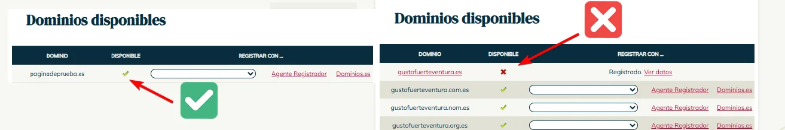

!!! tip Importante
    Debemos enfocarnos sobre todo en que el cliente nos cuente a que se dedica y sus servicios, para saber como enfocar bien el diseño de la web.

### Post 1º reunión

Una vez terminada la reunión, la persona asignada a crear la web buscará plantillas que concuerden con el sector del cliente, usualmente 4-5 que puedan resultar interesantes. 

Las páginas que solemos usar para buscarlas son:

- Para el Tema de Divi:
   - [**Elegant Themes - Divi Layouts**](https://www.elegantthemes.com/layouts/)
   - [**Divi Express**](https://divi.express/)

También compartiremos la carpeta "**Datos**" con el coreo personal del clente donde nos compartirá toda la información necesaria para crear la página web.

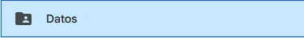

### Conseguir  el dominio
Este paso se lo dejaremos a Cristian, ya que es el que tiene acceso a la cuenta de **FuerteHost** donde tenemos los dominios y reservará el dominio que haya elegido el cliente en la reunión.

### Instalar Wordpress desde Fuertehost
Normalmente cristian será el mismo que instale el Wordpress desde el panel de control de FuerteHost, pero si no es así, se puede hacer desde el CPanel de la web. Para ello podemos mirar el tutorial de <a href="/docs/01_Guias/01_Web_Principal/01_Instalar_Wordpress/README.md"> **Instalar Wordpress**.</a>

### Instalar y activar Divi
Normalmente cuando se instala Wordpress, instalamos también un paquete creado por Ordenatech de Kit Digital donde ya viene instalado el tema de Divi y los plugins necesarios para empezar a trabajar.

Una vez instalado, avisaremos a Marco de que mnde ticket a Sered para que nos activen Divi, esto puedde tardar de unos minutos a unas horas.

## Fase 2: Desarrollo de la web
### Crear las cuentas de correo necesarias desde el CPanel

Para crear cuentas de correo, ver el correo creado en dominio o añadir reenviadores, consulta el siguiente documento: <a href="/docs/01_Guias/01_Web_Principal/05_Cuentas_de_correo/index.md"> **Creación de correos.**.</a>
Redirección al tutorial

### Revisar plugins

Antes de comenzar a trabajar en la web, es importante revisar los plugins que se instalaron en el paquete de Kit Digital, simplemente verificaremos que estén todos actualizados a la última versión sin ningún conflicto.

Para ello en el Escritorio de Wordpress, iremos a la pestaña de plugins y verificaremos que esté todo correcto.

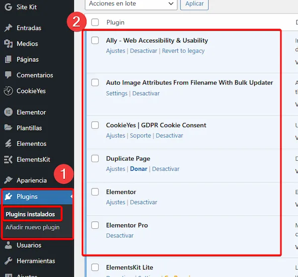
<br>
En caso de que hubiera algún plugin que necesite actualizarse, será el propio wordpress que nos lo indique con un círculo rojo con el número de plugins dentro que faltan por actualizar.

### Crear páginas principales

Una vez activado el Divi, procederemos a crear las páginas principales que nos haya indicado el cliente en la reunión (normalmente [Inicio, Sobre Nosotros, Servicios/Productos, Contacto]). Para ello, iremos a la pestaña de "**Páginas**" y "**Añadir nueva Página**".

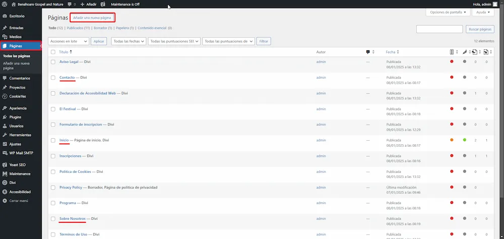
<br>
Con esto crearemos la estructura principal de la web, donde luego iremos añadiendo el contenido que nos haya pasado el cliente.

### Menú

Una vez creadas las páginas principales, podremos crear el menú principal que colocaremos en el Header.

Iremos a "**Apariencia**" ➡️ "**Menús**" ➡️ "**Crear un nuevo menú**".

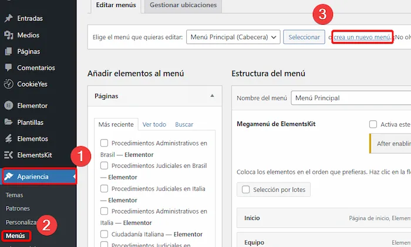
</br>
Ahora rellenaremos el campo de "*Nombre*" con ➡️ Menú Principal

Y seleccionaremos en "*Dónde se verá*" ➡️ Menú Principal

Para crearlo, simplemente pulsamos en "**Crear menú**" y se nos creará el menú.

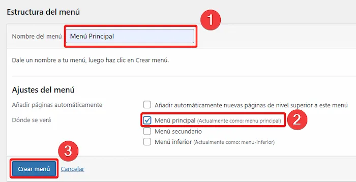 <br>


En este menú añadiremos las páginas que hemos creado anteriormente. Para ello, simplemente seleccionamos las páginas que queremos añadir (en el menú de la izquierda) y pulsamos en "**Añadir al menú**".


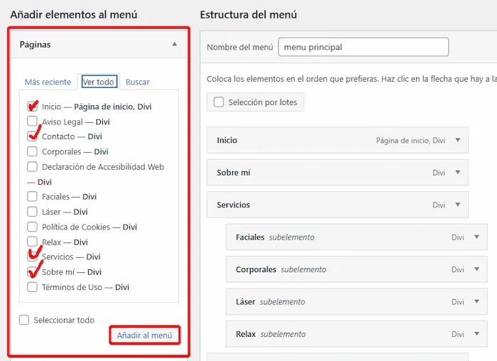

<br>
Por último, le daremos a "**Guardar menú**" y ya tendremos el menú creado con todas las páginas creadas.

### Enlaces permanentes

Si accedemos al dominio del cliente, notaremos que aunque hemos creado las páginas principales y el menú, estos no se ven. Porque Wordpress no está pillando la página de **Inicio** como la página principal. Para ello deberemos cambiar los enlaces permanentes.

Accedemos a "**Ajustes**" ➡️ "**Enlaces permanentes**" y seleccionamos la opción de "**Nombre de la entrada**".

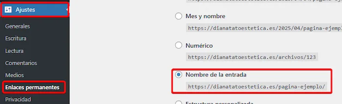
<br>
Una vez hecho esto, le daremos a "**Guardar cambios**" y ya tendremos el nombre de los enlcaes cambiados. Ahora la página de **Contacto** por ejemplo se mostrará como [domino del cliente]/contacto/ y no con un nombre raro.
<br></br>
Pero esto no es todo, deberemos acceder a **Ajustes** ➡️ "**Lectura**" y seleccionar la opción de "**Una página estática**". Colocar como página estática la página que queramos que sea la principal, usualmente **Inicio**.

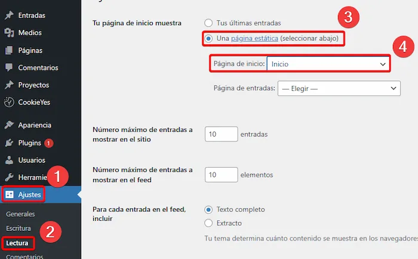


### Footer

Para añadir el footer, nos podemos guiar por la siguiente documentación: <a href="/docs/01_Guias/01_Web_Principal/03_Footer/README.md"> Añadir Footer</a>


- Añadir el footer.json
    1. Descargar Footeer.js dle repositorio
    2. Ir a theme Builder de divi
    3. Clicar en la imagen de importar (ver abajo)
    5. Importar desde archivo y se importará solo el footer
    6. Guardar Cambios
- Seleccionar la página de inicio como la que inicia el sitio
    1. Apariencia -> Personalizar
    2. Ajustes de página de inicio
    3. Seleccionar una página estática
    4. Y seleccionar como página de Inicio "Inicio"
- Editar encabezado
    1. Apariencia -> Personalizar
    2. Cambiar encabezado a gusto
- Empezar a editar con Divi
      1. Elegir un diseño para empezar

- Para formularios añadir reCaptcha v3
      1. buscarlo en google
      2. Entrar y añadir el sitio
      3. Copiar claves y añadirlas al form
  Si uso ContactForm 7 -> Contacto -> integración -> reCaptcha ->

- Completar Yoast SEO
    1. Ir al apartado de Yoast SEO y seguir con la foniguración inicial
    2. Ir a "editar" en la página de inicio y rellenar el apartado de Yoast SEO debajo
    3. Rellenar también "Básicos del sitio" y "Representación del sitio"

- Añadir idiomas
    1. Ir a plugis -> Gtranslate -> Ajustes
    2. En ajustes configurarlo como la siguiente imagen
     
    4. Añadir el css personalizado al final
         ```css
       @media (min-width:1200px){
        .gtranslate_wrapper{
            display: flex;
            align-items:center;
            gap: 5px;}
    6. Vamos a menú -> Seleccionamos menú principal
    7. Añadimos un Enlace personalizado
    8. En url ponemos [gtranslate]
    9. Añadimos al menú
    10. Editamos la etiqueta de navegación y le ponemos [gtranslate] también
- Google My Business
- Indexación
    1. Google Search console
          - Añadir link de la Web
          - Copiar HTML tag
          - Ir a Yoast SEO -> Ajustes -> "General" - Conexiones del sitio
          - Pegar el HTML tag copiado
          - Ir a Search console y darle a verificar HTML tag
          - Realizar captura de que se añadió correctamente para la justificación
          - Compartir el Search console con Marco y Cristian
    2. Bing
          - Añadir link de la Web
          - Copiar HTML tag
          - Ir a Yoast SEO -> Ajustes -> "General" - Conexiones del sitio
          - Pegar el HTML tag copiado
          - Ir a Bing y darle a verificar HTML tag
          - Realizar captura de que se añadió correctamente para la justificación
          - Compartir el Search console con Marco
    3. Cylex
    4. Firmania
    5. Encuentre Abierto

- Justificación

Imagen importar:


