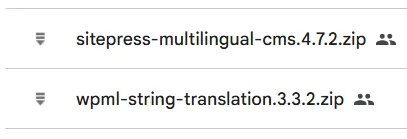

  <strong>Autor:</strong> {{ page.meta.author }} &nbsp;|&nbsp;
  <strong>Fecha:</strong> {{ page.meta.date }} &nbsp;|&nbsp;
  <strong>Etiquetas:</strong> {{ page.meta.tags | join(", ") }}

# 🌍{{ page.meta.title }}

{{ page.meta.description }}
 

> 

---

## ¿Qué es WPML? 🤔

WPML (WordPress Multilingual Plugin) es un plugin premium que permite traducir tu sitio WordPress a múltiples idiomas, facilitando tanto traducciones manuales como automáticas con herramientas avanzadas como DeepL y gestión de equipos de traducción.  
¡Ideal para sitios que quieren llegar a todo el mundo! 🌐

---

## Instalación de WPML 🛠️

### 1. Descarga del Plugin

WPML es de pago, se compró en su momento, así que usaremos esos archivos.

Accederemos a la carpeta de Drive de [7. Herramientas](https://drive.google.com/drive/folders/1yxh1u1o7cKVKYAGXgET9p8jUg0so7YFL?usp=drive_link).

Y descargamos los archivos

### 2. Instalación en WordPress

1. Ve a **Plugins > Añadir nuevo**.
2. Haz clic en **Subir plugin** ⬆️.
3. Selecciona el archivo ZIP y haz clic en **Instalar ahora**.
4. Repite para los módulos adicionales.
5. Actívalos desde **Plugins instalados** ✅.

!!! tip "Consejo"
    El único archivo esencial para instalar WPML es el de “sitepress-multilingual-cms.4.7.2”. El resto es opcional, aunque puede ayudar mucho instalar los otros Plugins.
---

## Configuración Inicial ⚙️

Al activar WPML, se abre un asistente dividido en varias fases:

### Selección de Idiomas 🗣️

- Elige el idioma principal de tu sitio.
- Añade los idiomas a los que deseas traducir tu web (autocompletado disponible).

### Formato de URL Multilingüe 🔗

Define cómo se mostrarán las URLs por idioma:

| Opción                       | Ejemplo                       | Recomendación         |
|------------------------------|-------------------------------|-----------------------|
| Directorios por idioma 📁     | /es/, /en/, /de/              | Más recomendado 👍     |
| Subdominios 🌐                | es.tusitio.com                | Opcional              |
| Dominio diferente por idioma 🌍| tusitio.es, tusitio.de        | Para proyectos grandes|

!!! tip "Consejo"
    Usar directorios facilita la gestión y el SEO multilingüe.

### Registro y Activación de WPML 🔑

- Ingresa la clave de tu sitio, obtenida en tu cuenta WPML (Pedirsela a Marco).
- Sin clave, no podrás usar el plugin ni recibir actualizaciones.

### Asignación de Traductores 👥

- Decide quién gestionará las traducciones:
  - Solo tú (Admin)
  - Otros usuarios del sitio (puedes asignar pares de idiomas)
  - Servicio de traducción profesional externo

### Opciones de Soporte y Complementos 🧩

- Puedes optar por enviar información sobre tus plugins y tema activo a WPML para recibir soporte y alertas de compatibilidad más rápido.
- WPML detectará plugins compatibles (ej. Yoast SEO) y sugerirá instalar complementos específicos. Lo instalaremos.

### Finalización 🎉

- Haz clic en **Ir al Panel de Traducción** para terminar la configuración inicial.

---

## Primeros Pasos Tras la Configuración 🚦

### Gestión de Idiomas 🌏

- Cambia el idioma principal o añade/elimina idiomas desde **WPML > Idiomas**.
- Personaliza las banderas 🏳️ y el orden de los idiomas.
- Configura los "switchers" (interruptores) de idioma en menús, footers, widgets, etc.

### Formato de URL y Banderas 🚩

- Ajusta el formato de URL y elige el estilo de las banderas que representan cada idioma.

### Switchers de Idiomas 🔄

- Añade interruptores de idiomas en menús de navegación, pies de página, enlaces, etc., según las necesidades del proyecto.

---

## Realizar Traducciones con WPML ✍️

### 1. Traducción de Páginas y Entradas 📄

- Ve a **Páginas > Todas las páginas**.
- Verás nuevas columnas para cada idioma.
- Haz clic en el icono correspondiente para traducir:
  - ➕ (Más): Si la página NO tiene traducciones.
  - ⚙️ (Engranaje): Si la página está siendo modificada.
  - ✏️ (Lápiz): Si la página ya está traducida.
  - 🔄 (Actualizar): Si hay cambios pendientes en la traducción.

### 2. Uso del Editor de Traducción 📝

- El editor muestra el texto original a la izquierda y el campo de traducción a la derecha.
- Puedes usar traducción automática 🤖 (consume créditos) o traducir manualmente.
- Atajos útiles:
  - **Ctrl + Enter**: Guardar traducción 💾.
  - **Alt + número**: Aplicar formato especial (negrita, subrayado, etc.) en la traducción.

### 3. Progreso y Finalización 📊

- Una barra de progreso indica el avance de la traducción.
- El botón **Finalizado** solo estará disponible al completar el 100% de la traducción.

---

## Recursos Útiles 📚

- [🌐WPML - Sitio Oficial](https://wpml.org/)
- [🈳DeepL Translate](https://www.deepl.com/translator)
- [🔴Instalación de WPML](https://www.youtube.com/watch?v=FN4lo11063o)
