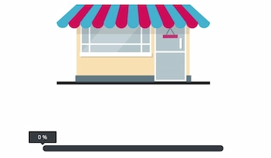
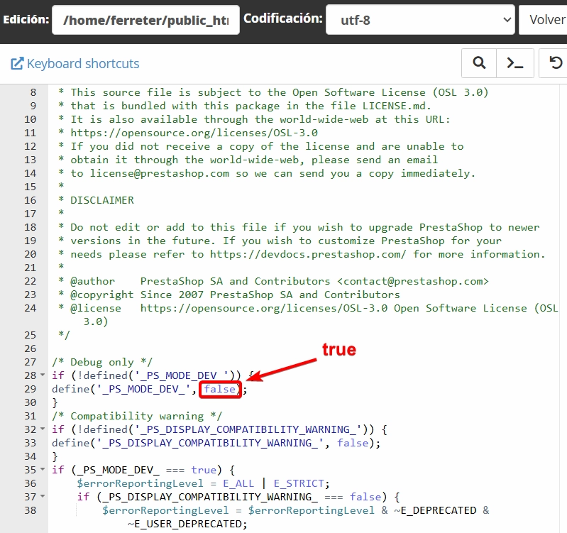
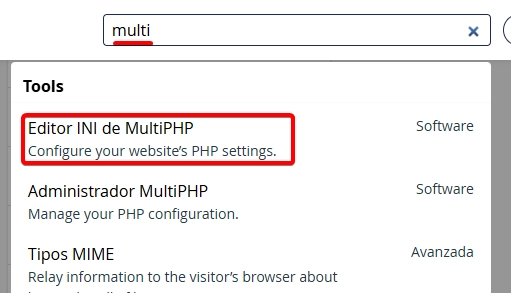
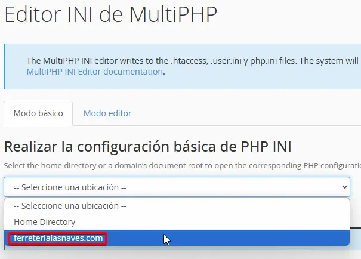
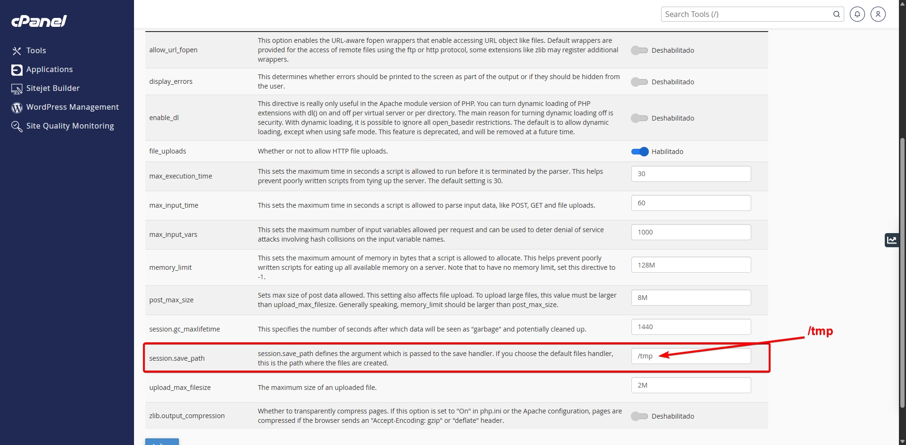
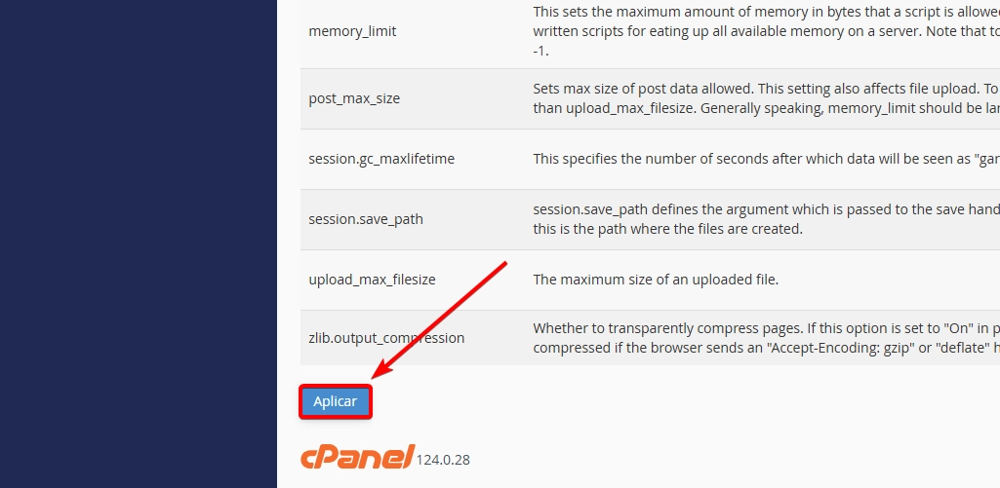
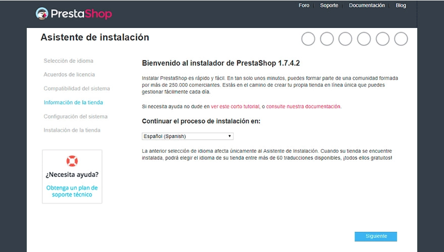

# Error instalación de Prestashop

!!! error

    Realmente lo que falla no es el instalador, sino que no detecta la ruta exacta que debería detectar para empezar a instalarlo.

### ¿Cúal es el error?
Cuando intentamos intalar Prestashop desde el administrador de archivos, no con el Instalatron, este nos da un error que a simple vista no veremos porque la página se mandtendrá en blanco.

Primero nos aparecerá la pantalla de instalación y acto seguido, cunado llegue al 100%, la página se quedará en blanco y no podremos hacer nada.

### ¿Cómo ver qué falla?
Esto se debe a que no vemos los errores porque el modo debbug está desactivado. Para activarlo, debemos ir a la carpeta de Prestashop y buscar el archivo `config/defines.inc.php`. Y cambiar el valor de `define('_PS_MODE_DEV_', false);` a `define('_PS_MODE_DEV_', true);`.

Con esto, al recargar la página, nos mostrará el error que nos está dando y podremos solucionarlo.

### ¿Cómo solucionar el error?
En mi caso el error era un error de ruta de archivo.
Accederemos al CPanel, y buscamos la herramienta **"Editor INI de MultiPHP"**. 

Accedemos y seleccionamos el dominio en el que estamos trabajando.

#### Cambiar ruta de sesión
En el apartado de **"session.save-path"** cambiaremos la ruta a **"/tmp"**. Esto nos permitirá que el instalador reconozca la ruta donde va a guardar las sesiones y nos permitirá instalar Prestashop.

Una vez hecho este cambio, en la parte inferios izquierda le daremos a **"Aplicar"** para que se guarden los cambios.

Volvemos a la pantalla donde estabamos con los errores, recargamos y se debería iniciar el instalador de Prestashop.

Podremos seguir los pasos e instalar el prestashop sin problemas.