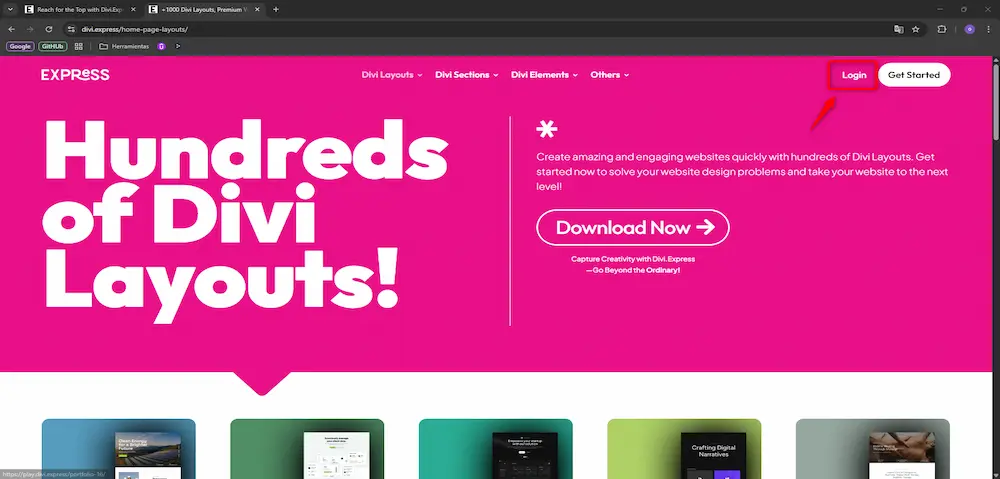
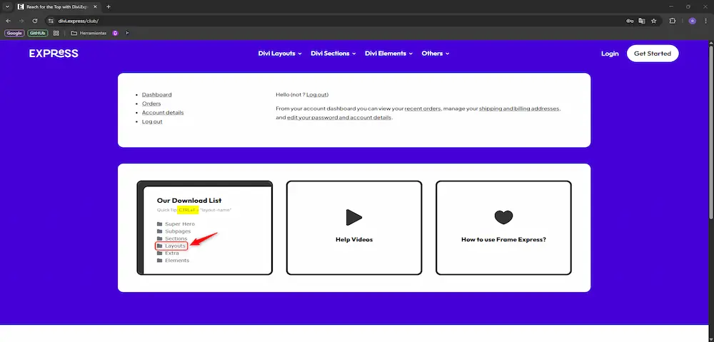
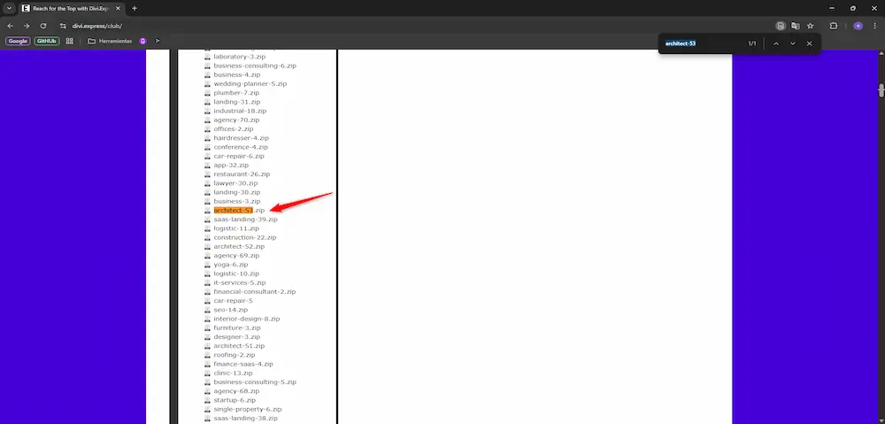
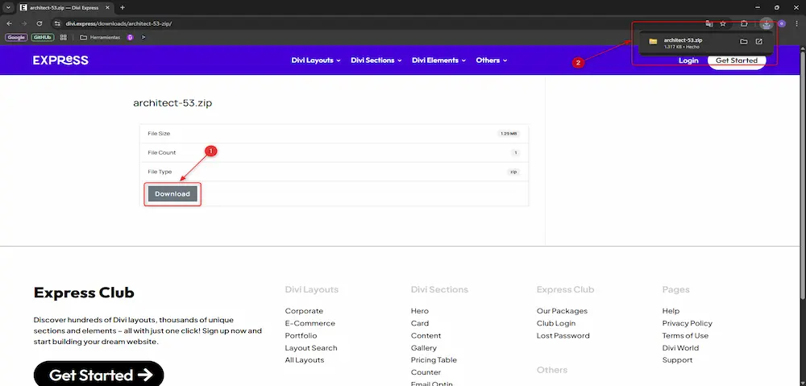

  <strong>Autor:</strong> {{ page.meta.author }} &nbsp;|&nbsp;
  <strong>Fecha:</strong> {{ page.meta.date }} &nbsp;|&nbsp;
  <strong>Etiquetas:</strong> {{ page.meta.tags | join(", ") }}

# 🚅{{ page.meta.title }}

{{ page.meta.description }}

## 🌐 Iniciar sesión en Divi Express
Primero de todo debemos iniciar sesión en Divi Express (pedir las credenciales de acceso al responsable de Orednatech):

## 🔎 Buscar Plantilla

Una vez estamos dentro vamos a la carpeta de Layouts y con Ctrl + F buscamos el nombre de la plantilla que hemos seleccionado para el cliente.

En nuestro caso hemos seleccionado la architect-53. Una vez la encontramos clicamos encima de ella.

Finalmente clicamos en Download y ya tenemos el archivo .zip descargado con el tema de Divi Express para poderlo importar en Divi.

