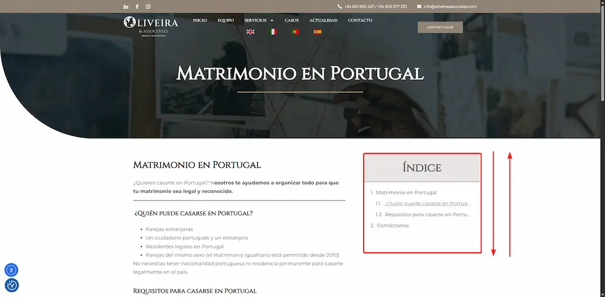

<div class="metadata" style="font-size: 0.9em; color: #555; margin-bottom: 0.5rem; line-height: 1.4;">
  <span><strong>Autor:</strong> {{ page.meta.author }}</span> &nbsp;|&nbsp;
  <span><strong>Fecha:</strong> {{ page.meta.date }}</span> &nbsp;|&nbsp;
  <span><strong>Etiquetas:</strong> {{ page.meta.tags | join(", ") }}</span>
</div>

# {{ page.meta.title }}

{{ page.meta.description }}




---

## 📌 ¿Qué es Sticky Sidebar?

Una barra lateral *sticky* (fija) es un elemento que permanece visible en la pantalla a medida que el usuario se desplaza por la página. Es ideal para menús de navegación, índices de contenido, CTAʼs, etc.

---

## 🛠 Paso 1: Estructura en Elementor

1. Abre tu página en Elementor.
2. Asegúrate de tener dos secciones:
   - Una **barra lateral o índice de contenido** (que se fijará).
   - Un **contenedor principal o columna** donde estará el contenido (que limita el scroll).

---

## 🎯 Paso 2: Asignar clases a los elementos

Debes aplicar clases específicas a los elementos para que el efecto *sticky* funcione correctamente:

- Al índice o barra lateral, asígnale la clase:
  ```
  sidebar-sticky
  ```

- Al contenedor principal que actúa como límite, asígnale la clase:
  ```
  content-wrapper
  ```

💡 *Para asignar una clase en Elementor:*  
Haz clic en el elemento → Avanzado → Clase CSS → Escribe el nombre correspondiente.

---

## 💻 Paso 3: Añadir el código CSS personalizado

Ve al panel de **Apariencia > Personalizar > CSS adicional**, o agrégalo directamente en Elementor (en la pestaña de *Avanzado > CSS personalizado*, si usas Elementor Pro) y pega el siguiente código:

```css
/* Contenedor que limita el scroll */
.content-wrapper {
  position: relative;
}

/* El bloque sticky */
.sidebar-sticky {
  position: -webkit-sticky;
  position: sticky;
  top: 200px; /* Ajusta este valor según el espacio que necesites desde el top */
  align-self: flex-start;
}
```

✏️ *Tip:* Puedes ajustar el valor de `top: 200px;` para definir a qué altura del viewport comienza a fijarse el índice.

---

## 🧪 Paso 4: Probar el comportamiento sticky

Guarda y carga tu página. Al hacer scroll, tu índice debería mantenerse visible hasta que alcance el final del contenedor padre.

Si no funciona:

- Asegúrate de que no hay `overflow: hidden` en elementos padres.
- Verifica que ambas clases están correctamente aplicadas.
- Comprueba que tu página tenga suficiente contenido para hacer scroll.

---

## ✅ Resultado final

Tu índice ahora se comportará como un *sticky sidebar* profesional, mejorando la navegación y la experiencia del usuario.


