

  <strong>Autor:</strong> {{ page.meta.author }} &nbsp;|&nbsp;
  <strong>Fecha:</strong> {{ page.meta.date }} &nbsp;|&nbsp;
  <strong>Etiquetas:</strong> {{ page.meta.tags | join(", ") }}

# {{ page.meta.title }}

{{ page.meta.description }}

---

## Creación del Link de Stripe

Stripe es una pasarela de pago que permite ser implementada en una web de diferentes formas. Aquí aprenderás cómo hacerlo en WordPress **sin plugins**.

!!! tip "Consejo"
    Para que el cliente pueda autogestionar los productos y enlaces de pago, se recomienda que la cuenta de Stripe utilizada sea la del propio cliente.

1. Accede a tu cuenta de Stripe y entra al Dashboard.
2. Haz clic en el botón `+` y selecciona Enlace de pago en el submenú.

    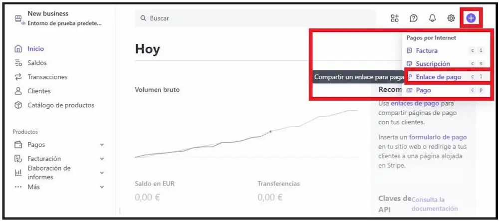
     Seleccionar la opción para Crear un Enlace de Pago

3. Se abrirá la página para crear el enlace de pago:

    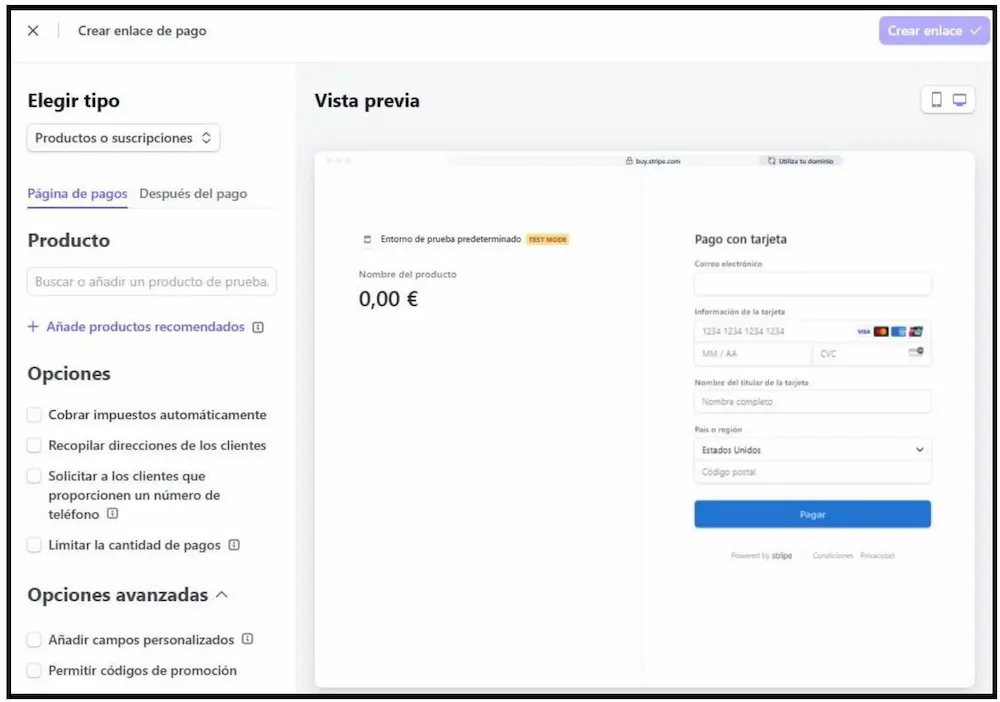
     Página de Creación del Enlace de Pago

### Apartados principales

#### Elegir Tipo

Por regla general, el tipo de producto más habitual es **Productos o suscripciones**. La opción **Los clientes deciden qué pagar** es útil para donaciones o propinas.

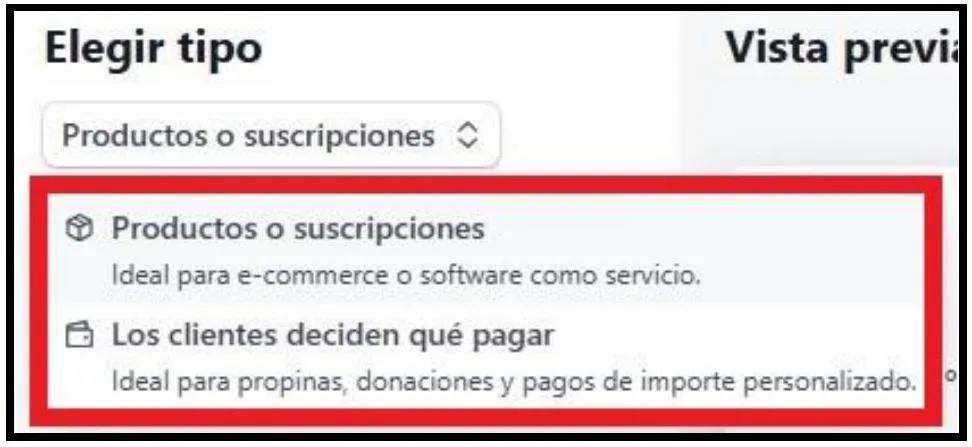
 Elegir el tipo de Enlace de Pago

#### Opciones

Aquí puedes seleccionar opciones como **Cobrar impuestos automáticamente**, según las necesidades del cliente y del proyecto.

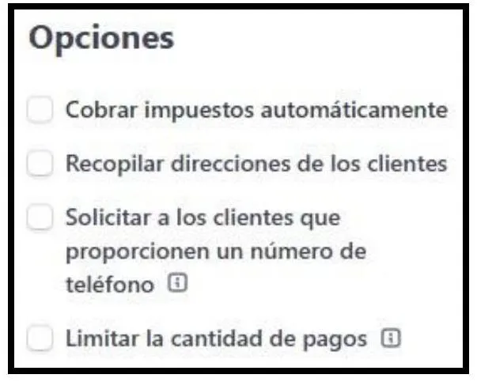
 Opciones del Enlace de Pago

#### Opciones Avanzadas

Opciones técnicas adicionales (opcional).

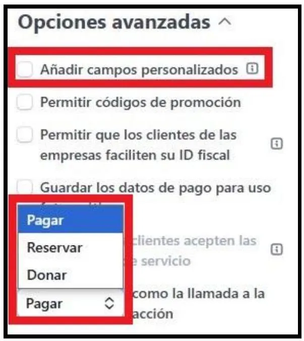
 Opciones Avanzadas del Enlace de Pago

#### Producto

Selecciona un producto existente o crea uno nuevo.

---

## Configurar un nuevo Producto

La primera vez que uses Stripe para este tipo de implementación, probablemente no haya productos creados. Selecciona + Añadir un Producto Nuevo.

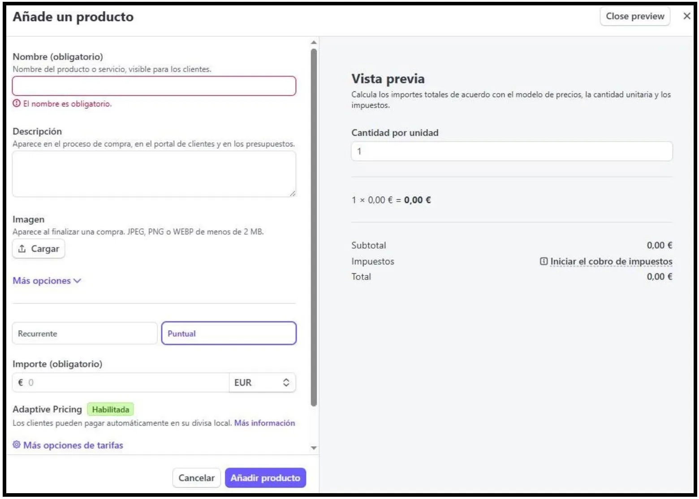
 Página de Creación del Producto

### Nombre, descripción e imagen

El **nombre** es obligatorio, pero es recomendable añadir también descripción e imagen para un producto más completo.

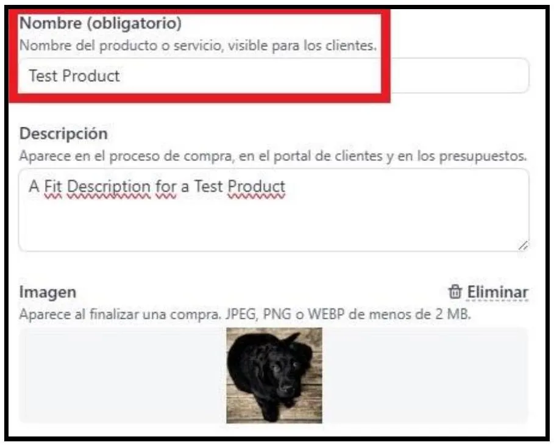
 Datos principales del Producto

### Más opciones

Si lo necesitas, despliega **Más opciones** para configurar detalles técnicos como Stripe Tax, descripción en extracto bancario, etiquetas, metadatos o funciones de marketing.

### Importe

Elige si el producto es de pago Puntual o recurrente Suscripción y especifica el importe y la divisa.

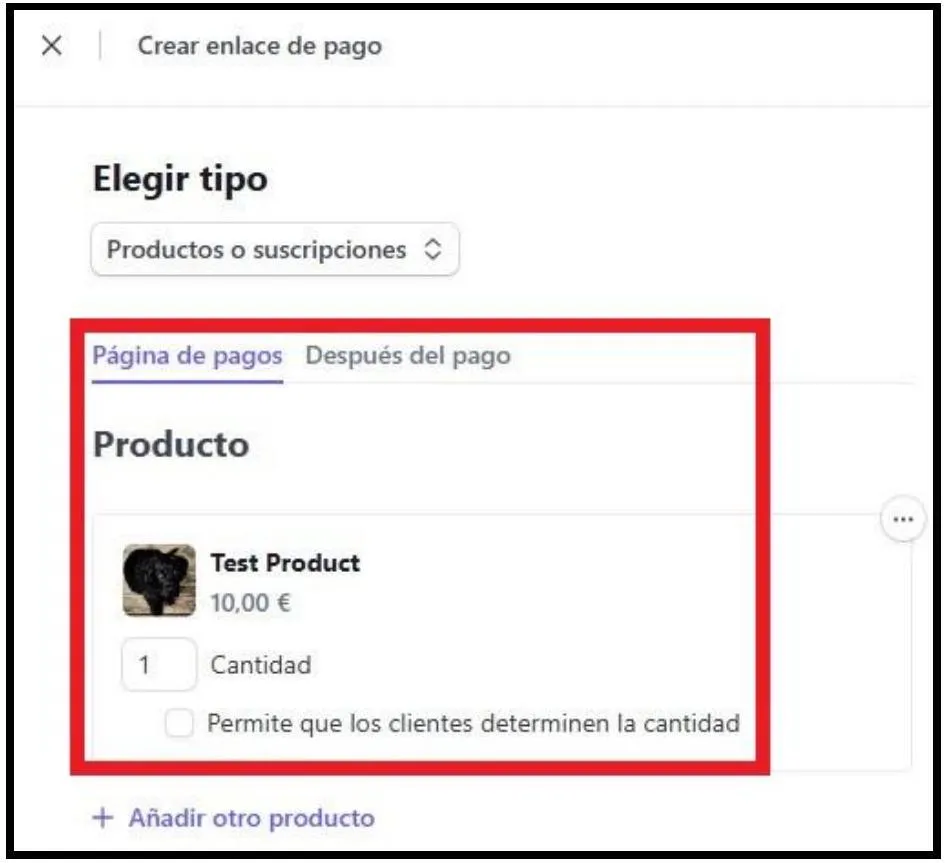
 Opciones del Producto Creado

Puedes añadir precios por divisa y configurar opciones avanzadas de precios. Haz clic en Añadir producto para incluirlo en el enlace de pago.

### Vista previa

En la columna de **Vista Previa** puedes ver cómo quedarán los cambios en la página de pago.

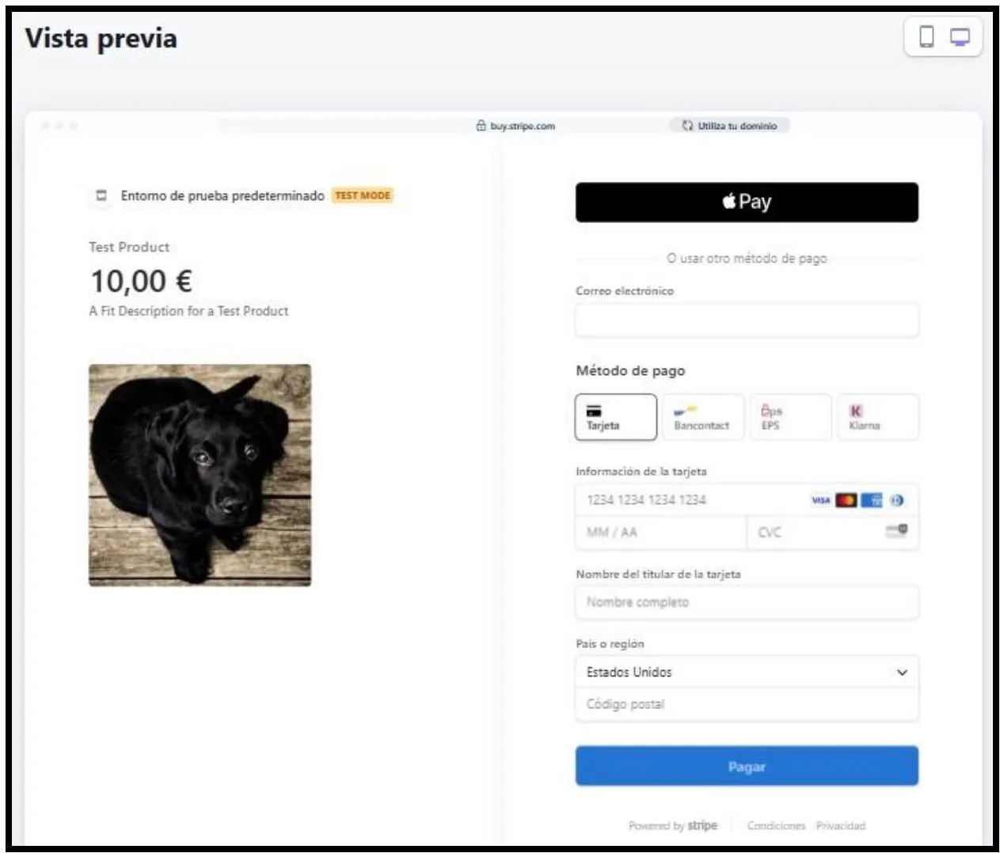
 Vista Previa de la Página a la que llevará el Enlace de Pago

Cuando termines, haz clic en **Crear enlace**.

---

## Revisar y probar el enlace de Stripe

Al crear el enlace, aparecerá la sección Payment Links en la barra lateral del Dashboard. Aquí puedes gestionar todos los enlaces y sus productos.

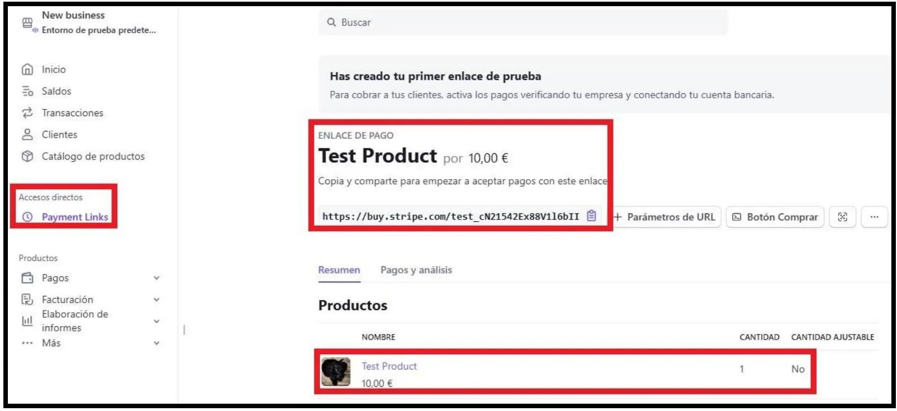
 Datos del Enlace de Pago creado

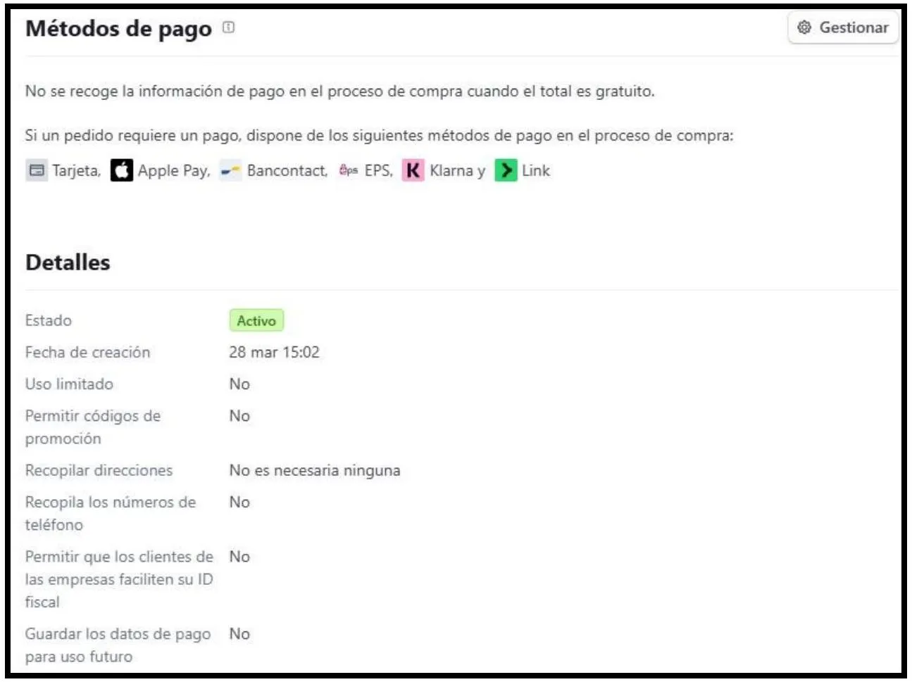
 Detalles del Enlace de Pago Creado

Copia el enlace y pégalo en tu web (botón, texto o enlace).

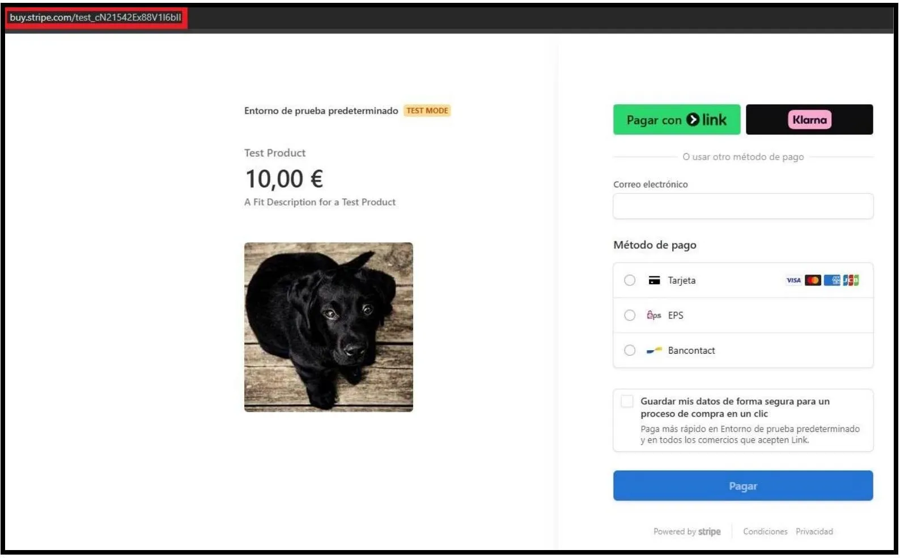
 Acceder a la página del enlace de pago

!!! info "Nota"
    Si ves el mensaje "Entornos de prueba predeterminado", significa que estás usando una cuenta de pruebas de Stripe.

---

## Acciones sobre el enlace

En la sección **Payment Links**, haz clic en los tres puntos (`...`) junto a un enlace para ver opciones como **Editar** o **Desactivar**.

 Acciones Disponibles sobre el Enlace de Pago

---

## Editar un enlace

Selecciona **Editar** para modificar el enlace. Se abrirá la misma página de creación para realizar los cambios necesarios.

 Página para editar el enlace de pago

 Vista previa de los cambios realizados

Haz clic en **Actualizar Enlace** para guardar los cambios.

---

## Desactivar un enlace

Selecciona **Desactivar** para inhabilitar el enlace. Confirma la acción en la ventana emergente.

!!! warning "Cuidado"
    Stripe no permite eliminar enlaces de pago, solo desactivarlos. Puedes reactivar el enlace más adelante si lo necesitas.

---

## Notas finales

- Puedes incluir el enlace de pago en tu web como texto, botón o enlace dentro de una frase.
- Gestiona productos y enlaces fácilmente desde el dashboard de Stripe.
- Utiliza las opciones avanzadas solo si realmente lo necesitas.

---

¡Listo! Ahora puedes integrar pagos con Stripe en tu WordPress de forma sencilla y sin plugins.
